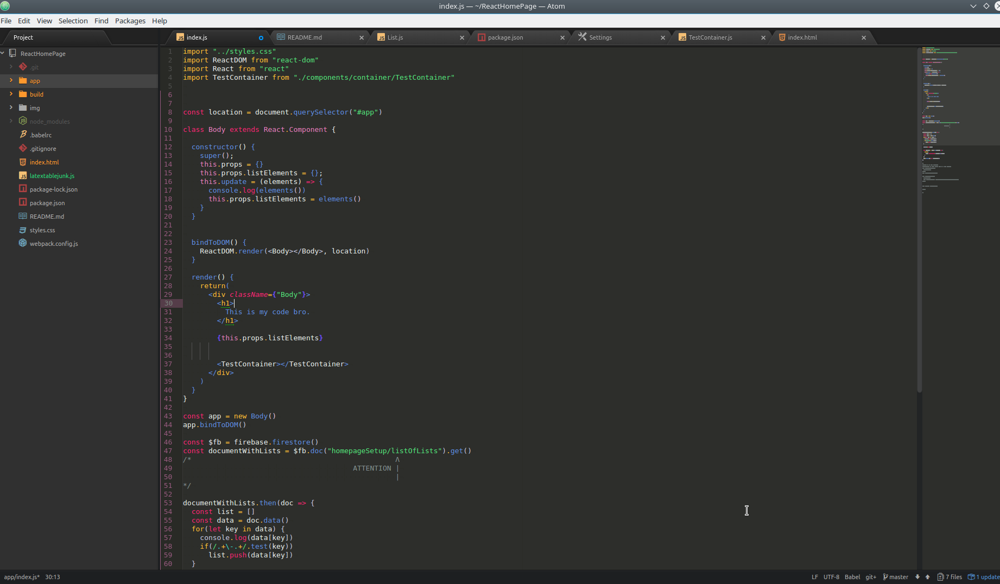
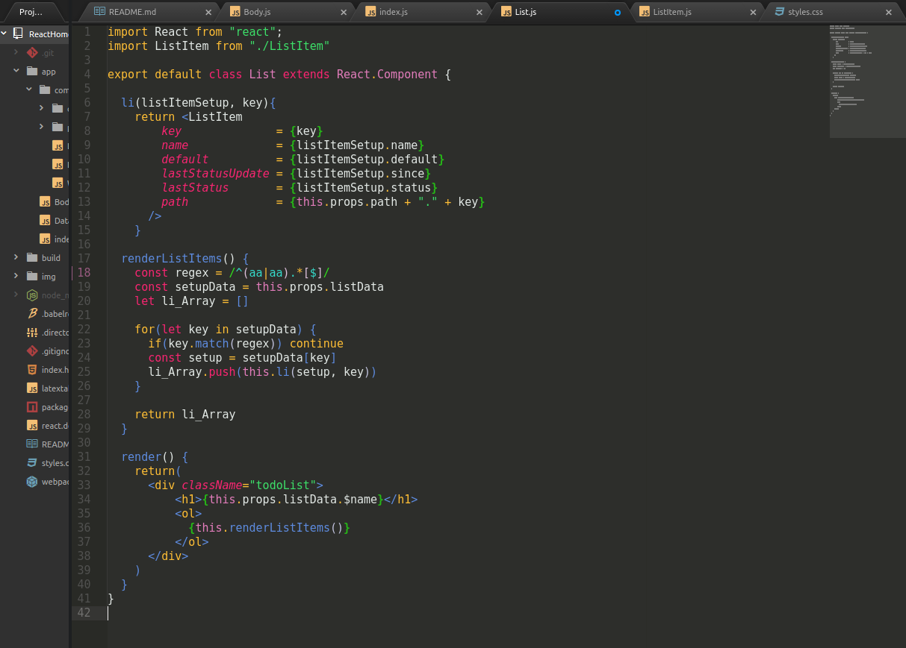
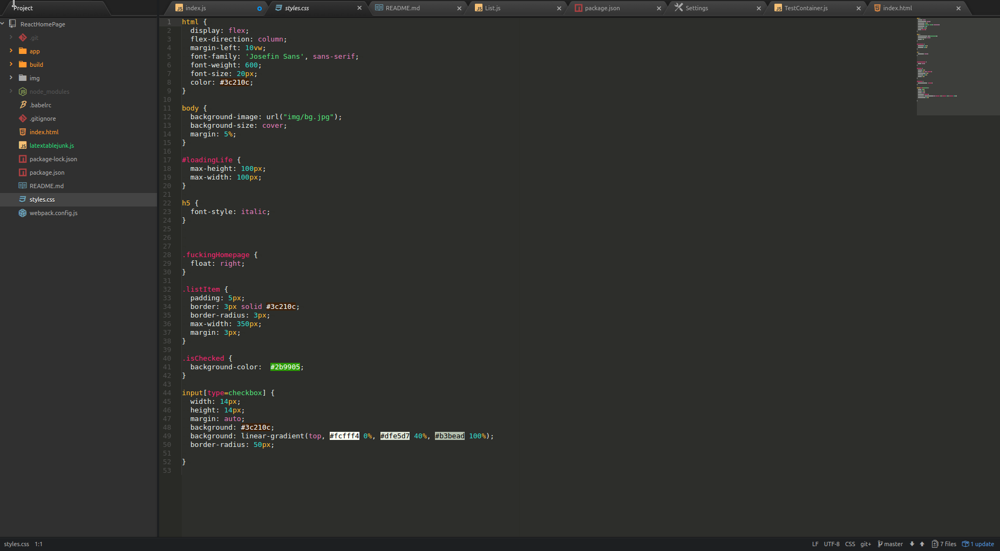
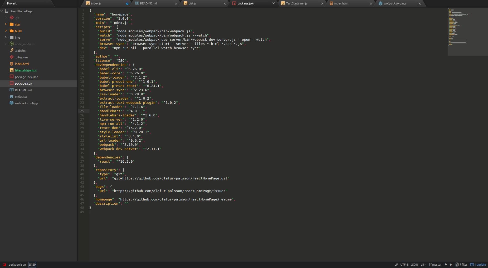
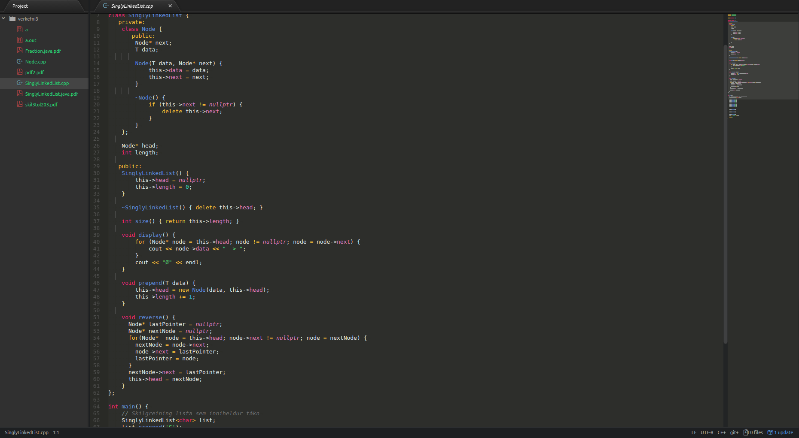
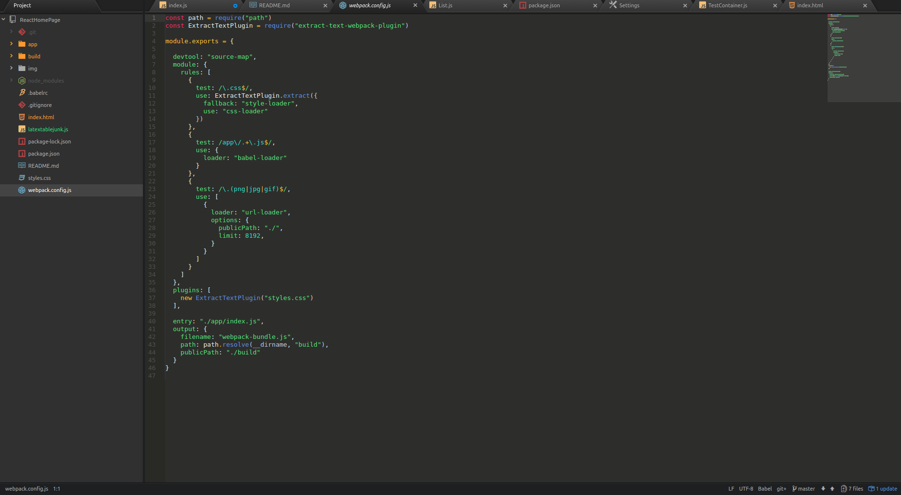

:poop:

# Still contrasts while redshifted
I.e. it works with f.lux.

Focus on high contrast and readability while not being irritating (or irradiating like atomic-monokai, ok i quit).

Also verified looks good with...
-C++
-Java
-JS/JSX/React
-Python
-CSS/less
-Object Notation and .json
-Haven't checked the rest because I don't care and nobody is paying me to do this.

## Features!!! 16.2.18:
1. PROPER REGEX (it's actually readable now to people who know it, lol).
2. String green and Integer teal now contrast a little more.
3. Embed color (blue-purple #9580FF) -> (green #31E31E).

